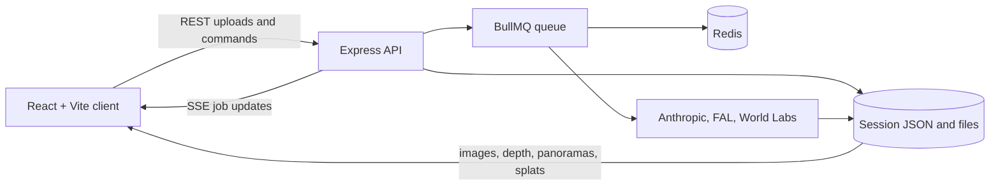

# 3D House Walkthrough

3D House Walkthrough turns a floor plan and a set of room photos into a browser-based, first-person home tour. The application uses AI to detect rooms and furniture, builds navigation geometry from the floor plan, and can generate a panorama and Gaussian splat for each photographed room.

> **Project status:** functional prototype. It is designed for local development and single-floor homes; authentication, durable cloud storage, and a production deployment pipeline are not included yet.

## How it works

1. Upload a floor plan as JPEG, PNG, WebP, or PDF (20 MB maximum).
2. The server asks Claude to identify rooms, normalized bounds, doors, windows, dimensions, and confidence scores.
3. Review the detected overlays, rename rooms, remove mistakes, or add rooms manually.
4. Upload one or more photos per room (15 MB maximum) and choose each room's primary photo.
5. Start generation. Each eligible room is analyzed for furniture and depth; configured World Labs jobs continue in the background to produce panoramas and `.spz` Gaussian splats.
6. Explore the resulting layout in the first-person viewer. Job updates arrive over Server-Sent Events (SSE), with polling as a fallback.

## Features

- AI-assisted floor-plan parsing with a visual correction screen
- Per-room photo collection, primary-photo selection, and coverage tracking
- Session-scoped JSON persistence and filesystem asset storage
- Redis-backed BullMQ processing with an in-process fallback
- Optional FAL depth estimation and World Labs panorama/splat generation
- React Three Fiber walkthrough with collision detection and room transitions
- Gaussian splat rendering through Spark
- Desktop pointer-lock controls, a clickable minimap, and touch controls
- Live generation status through SSE

## Architecture



The Vite development server proxies `/api` and `/data` to the Express server. Session metadata is serialized per session to avoid concurrent read-modify-write races. If Redis is unavailable, generation jobs run inside the API process.

## Technology

| Area | Main tools |
| --- | --- |
| Client | React 18, TypeScript, Vite, Tailwind CSS |
| 3D | Three.js, React Three Fiber, Drei, Spark |
| Server | Node.js, Express, TypeScript, Multer |
| Jobs | BullMQ, Redis, SSE |
| AI services | Anthropic Claude, FAL.ai, World Labs Marble |
| Persistence | Local JSON and uploaded/generated files |
| Tests | Jest, Supertest |

## Requirements

- Node.js `20.19+` or `22.12+` (Node 22 is recommended)
- npm
- An Anthropic API key for floor-plan parsing and room analysis
- Redis for durable queued jobs (optional during development because the server can fall back to in-process execution)
- FAL.ai and World Labs keys for depth maps, panoramas, and Gaussian splats

## Quick start

Install all workspace dependencies from the repository root:

```bash
npm install
```

Create a root `.env` file. Keep real credentials out of source control.

```dotenv
ANTHROPIC_API_KEY=your-anthropic-key
WORLD_LABS_API_KEY=
FAL_API_KEY=
REDIS_URL=redis://localhost:6379
PORT=3001
GENERATION_MODE=
SESSION_TTL_HOURS=24
DATA_DIR=../data
```

Start Redis with Docker Compose:

```bash
docker compose up -d redis
```

Then start the client and server together:

```bash
npm run dev
```

Open [http://localhost:5173](http://localhost:5173). The API listens on [http://localhost:3001](http://localhost:3001).

For the most reliable parsing path, use a JPEG, PNG, or WebP floor plan. PDF is accepted by the upload layer, but the current parser sends non-PNG/WebP input as JPEG media.

## Viewer controls

| Input | Action |
| --- | --- |
| Click the viewer | Lock the pointer and start navigating |
| `W` / `S` or arrow keys | Move forward / backward |
| `A` / `D` or arrow keys | Strafe left / right |
| Mouse | Look around |
| `Esc` | Release pointer lock |
| `Tab` | Toggle the generation status panel |
| Click a minimap room | Teleport to the room center |
| Touch joystick / swipe | Move / look on touch-only devices |

## Environment variables

| Variable | Required | Purpose |
| --- | --- | --- |
| `ANTHROPIC_API_KEY` | Yes | Parses floor plans and analyzes furniture in plans and room photos. |
| `WORLD_LABS_API_KEY` | No | Generates room panoramas and 500k-point `.spz` splats. |
| `FAL_API_KEY` | No | Generates depth maps and uploads source photos used by World Labs. It is therefore required when World Labs generation is enabled. |
| `REDIS_URL` | No | BullMQ connection. Defaults to `redis://localhost:6379`. |
| `PORT` | No | Express port. Defaults to `3001`. |
| `GENERATION_MODE` | No | Setting `mock` currently bypasses Redis initialization, but does **not** stub the AI analysis calls. |
| `SESSION_TTL_HOURS` | No | Reserved for session cleanup; automatic cleanup is not implemented. |
| `DATA_DIR` | No | Session and asset directory. Workspace scripts default to `../data` from `server/`. |

## Available commands

Run commands from the repository root.

| Command | Description |
| --- | --- |
| `npm run dev` | Start the Express and Vite development servers together. |
| `npm run build` | Build the client workspace. |
| `npm run build --workspace=server` | Compile the server into `server/dist/`. |
| `npm start` | Start the compiled server. Build the server first. |
| `npm test --workspace=server` | Run the server Jest/Supertest suite. |
| `npm run lint --workspace=client` | Lint the client. |
| `npm run preview --workspace=client` | Preview the client production bundle. |

The server does not currently serve `client/dist`, so production client and API hosting must be configured separately.

## API overview

All endpoints are rooted at `/api/sessions`.

| Method and path | Purpose |
| --- | --- |
| `POST /api/sessions` | Create a session. |
| `GET /api/sessions/:id` | Read a complete session. |
| `POST /api/sessions/:id/floor-plan` | Upload and asynchronously parse a floor plan. |
| `GET /api/sessions/:id/floor-plan/image` | Read the uploaded floor plan. |
| `PUT /api/sessions/:id/rooms` | Replace the reviewed room list. |
| `POST /api/sessions/:id/rooms` | Add a manual room. |
| `DELETE /api/sessions/:id/rooms/:roomId` | Delete a room and its photos. |
| `POST /api/sessions/:id/rooms/:roomId/photos` | Upload a room photo. |
| `DELETE /api/sessions/:id/rooms/:roomId/photos/:photoId` | Delete a room photo. |
| `PUT /api/sessions/:id/rooms/:roomId/photos/:photoId/primary` | Select a primary photo. |
| `POST /api/sessions/:id/generate` | Enqueue one job per photographed room. |
| `GET /api/sessions/:id/jobs` | Poll generation jobs. |
| `GET /api/sessions/:id/events` | Subscribe to job updates over SSE. |
| `POST /api/sessions/:id/generate-panoramas` | Retry missing panoramas for completed jobs. |

Uploaded and generated files are available through session-specific API routes or the `/data` static mount.

## Project structure

```text
.
├── client/
│   ├── src/pages/          # Upload, review, photo, and walkthrough screens
│   ├── src/components/     # Viewer, minimap, HUD, and touch controls
│   ├── src/scene/          # Floor-plan scene and furniture builders
│   └── src/hooks/          # Movement and rendering-tier hooks
├── server/
│   ├── src/routes/         # Session, room, upload, and generation endpoints
│   ├── src/*Service.ts     # Anthropic, FAL, and World Labs integrations
│   ├── src/queue.ts        # BullMQ/in-process jobs and SSE notifications
│   └── src/SessionStore.ts # Filesystem-backed session persistence
├── data/sessions/          # Runtime uploads, metadata, and generated assets
├── openspec/changes/       # Original proposal, design, specs, and task history
├── docker-compose.yml      # Redis and API service definitions
└── package.json            # npm workspaces and root scripts
```

A session normally has the following shape on disk:

```text
data/sessions/<session-id>/
├── session.json
├── floor-plan/
├── photos/<room-id>/
├── depth/<room-id>/
└── panorama/<room-id>/
```

## Current limitations

- Sessions are anonymous, stored locally, and are not automatically expired.
- Only a single floor and axis-aligned rectangular room bounds are supported.
- Manually added rooms have no geometry and therefore cannot be placed in the walkthrough until geometry is supplied.
- The viewer currently renders generated splats; analyzed furniture, depth maps, and panorama-only output are stored but not used as visual fallbacks.
- Low-end mode reduces pixel ratio but does not currently skip splat loading or load a GLB fallback.
- `GENERATION_MODE=mock` is not a complete offline mock despite its name.
- The full Docker server image still needs a container-ready build/lockfile flow; use Compose for Redis and run the app with npm during development.

## Security

API keys are loaded only by the server. Never expose them through `VITE_*` variables or commit them in `.env`, `.env.example`, logs, or screenshots. If a real key has ever been stored in a tracked/example file, revoke it and issue a replacement before sharing or deploying the project.

